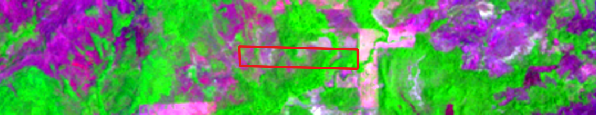
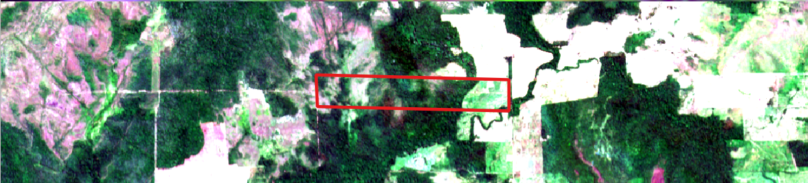

# 🛰️ Download de Imagens Landsat e Sentinel-2 com Google Earth Engine e Google Colab

Este repositório traz dois notebooks práticos desenvolvidos para automatizar o download de imagens Landsat e Sentinel-2 usando Python no Google Colab e dados vetoriais no formato shapefile.

## 📌 Funcionalidades

- Upload de shapefile `.zip` com área de interesse (AOI)
- Seleção de ano e semestre (Landsat) ou intervalo de meses (Sentinel-2)
- Geração da imagem correspondente com baixa cobertura de nuvens (≤10%)
- Link direto para download em formato GeoTIFF

## 🌎 Tecnologias utilizadas

- [Google Earth Engine](https://earthengine.google.com/)
- Google Colab
- Python (geemap, ee, pycrs)
- Sentinel-2 e Landsat (via GEE)

## 📁 Conteúdo

- `Download_Sentinel_e_Landsat.ipynb`: Notebook com ambos os scripts organizados por seção
- Compatível com `.zip` contendo os arquivos: `.shp`, `.shx`, `.dbf`, `.prj`

## 🖼️ Demonstrações

### Imagem Landsat

### Imagem Sentinel-2

## 🚀 Como usar

1. Faça login com sua conta do Google Earth Engine (GEE).
2. Substitua `ee.Initialize(project='seu-projeto')` com o ID do seu projeto GEE.
3. Faça upload do seu shapefile `.zip`.
4. Escolha o período desejado e clique no botão para gerar o link.
5. Baixe a imagem GeoTIFF gerada com até 10% de nuvens.

## 📷 Exemplos de uso

- Monitoramento multitemporal de imóveis rurais
- Apoio ao Cadastro Ambiental Rural (CAR)
- Avaliação de uso e cobertura do solo
- Análise ambiental e territorial

## ✍️ Autor

**Samuel Santos**  
Analista de Dados | Geoprocessamento | Meio Ambiente  
🔗 [LinkedIn](https://www.linkedin.com/in/samuelsantosambiental)
